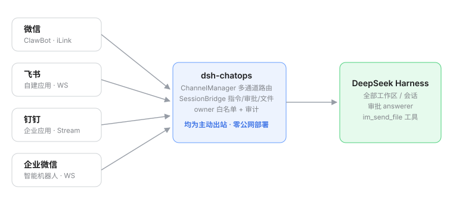

# dsh-chatops

> **用微信、飞书、钉钉、企业微信远程操控 DeepSeek Harness——IM 机器人直连全部工作区与会话，任务完成推送，危险操作远程审批。**
>
> Drive DeepSeek Harness from WeChat, Feishu, DingTalk and WeCom — IM bots bridged to every workspace and session, with completion push and remote approval.

[](LICENSE)
[](#兼容性与-profile)
[](#兼容性与-profile)

四通道并行的 IM 桥接插件：机器人和你私聊（或群 @）即可操作所有工作区和会话——发文字就是发 prompt，任务完成自动推送，危险操作推审批（飞书支持卡片按钮一键批准），生成的报告/图片/文件可直接回传到 IM。



---

## 截图

> 截图补充中（计划：`docs/images/settings-page.png` 设置页 · `docs/images/wechat-chat.png` 微信对话 · `docs/images/feishu-approval.png` 飞书审批卡）。
> 上手效果见下方「快速开始」各通道的对话示例。

## 功能特性

- 🔀 **四通道并行**：微信 / 飞书 / 钉钉 / 企业微信同时在线，指令集完全一致
- 📱 **微信（ClawBot / iLink）**：官方机器人平台，扫码绑定即用，普通微信里出现机器人联系人；`bot_token` 长效，重启免扫码
- 🐦 **飞书（自建应用）**：WS 长连接；审批发**交互卡片**（按钮一键批准）；任务发**流式进度卡**原地更新为结果
- 🟦 **钉钉（企业内部应用）**：Stream 长连接，文本/文件回传齐备
- 🟩 **企业微信（智能机器人）**：官方 aibot SDK 长连接（仅企业内成员可见）
- 🗂 **指令集**：`/sessions`（含 📦 冷会话自动唤醒）、`/use`、`/status`、`/log`（完整输出）、`/send <路径>`、`/approve` `/reject`
- 🚀 普通文字直接作为 prompt 发给绑定会话（首次自动绑定最近活跃会话）
- 📎 **文件回传**：模型可调用内置 `im_send_file` 工具主动把成果文件发到 IM（图片内联显示，其他为文件卡片）；`/log` 超长输出自动转 txt 文件
- 🖥 **设置页 GUI**：「设置 → IM 通道」面板——通道开关、凭据填写、状态监控、微信扫码绑定全部可视化（主题跟随深浅色）
- 🔐 **安全模型**：owner/白名单、工作区路径围栏、凭据入 DSH 凭据存储、全量审计日志、陌生人消息静默忽略

## 安装

```bash
# 从 GitHub 安装（推荐）
dsh plugin --profile web add github:ZhuoSir/dsh-chatops

# 或本地源码安装
dsh plugin --profile web add /path/to/dsh-chatops

# 重启生效
dsh web
```

然后打开 **设置 → IM 通道**，在面板上启用通道并填写凭据（微信无需凭据，直接面板内扫码）。

## 兼容性与 profile

| 项 | 要求 |
|---|---|
| DSH profile | `web`（完整功能）；headless profile 可跑通 Bot 收发，但无设置页/扫码页 |
| Node.js | ≥ 22（`AbortSignal.any` / `fetch` 依赖） |
| 操作系统 | macOS / Linux / Windows（wechaty 备选通道的 xp puppet 仅 Windows） |
| 网络 | 仅需**主动出站** HTTPS/WebSocket，零公网回调、零端口转发 |
| DSH 版本 | `0.1.0-rc.x`（peer: `@deepseek-ai/cordis ^4`、`dsh-llm`/`dsh-tools` rc.6） |

各通道官方 SDK 均为**可选依赖**（`@larksuiteoapi/node-sdk` / `dingtalk-stream` / `@wecom/aibot-node-sdk` / `wechaty`），随主包安装；未装时对应通道空转并在日志给出指引，不影响其他通道。

## 权限说明

### 插件自身的安全边界

- **网络**：仅出站连接各 IM 平台官方域名（`ilinkai.weixin.qq.com` / `open.feishu.cn` / `api.dingtalk.com` / 企微 WS 网关）；本机回环端口只暴露 `/chatops/*` 只读状态与配置端点（loopback 校验）；
- **凭据**：微信 `bot_token` 写入 DSH 凭据存储（`ctx.credentials`，文件兜底 0600 权限）；飞书/钉钉/企微凭据保存在本机 profile 配置中，**不上传任何第三方**；
- **文件**：文件回传只允许发送**当前会话工作区内**的文件（路径逃逸拒绝 + 审计）；大小上限默认 100MB（可配）；
- **访问控制**：微信扫码绑定者 / 飞书钉钉企微首个私聊用户自动成为 owner；其余人消息静默忽略并写审计日志（`storages/dsh-chatops/audit.jsonl`）；可用 `security.allowContacts` / `allowRooms` 收敛白名单；
- **审计**：绑定、指令、审批决策、文件发送全部留痕。

### 各通道需要的平台权限

| 通道 | 平台准备 | 权限/能力 |
|---|---|---|
| 微信 ilink | 无（扫码即建机器人） | 无需配置权限 |
| 飞书 | 开发者后台建自建应用 + 机器人能力 | `im:message`、`im:message:send_as_bot`、`im:resource`（文件回传）；事件订阅（长连接）：`im.message.receive_v1` + `card.action.trigger`（审批按钮必需）；发版生效 |
| 钉钉 | 开放平台建企业内部应用 + 机器人 | 消息接收选 **Stream 模式**；机器人消息收发权限；文件回传需媒体上传权限 |
| 企业微信 | 管理后台建智能机器人 | 无额外权限项；仅企业内成员可见 |

> ⚠️ wechaty 备选通道（个人号协议）违反《微信软件许可及服务协议》，存在封号风险，仅限自用、务必小号，默认关闭。

## 快速开始

### 微信（ilink，默认）

设置 → IM 通道 → 微信卡片内**扫码绑定**（或打开 `http://127.0.0.1:3080/chatops/qr`），手机确认后机器人和你打招呼：

```
/help            → 查看指令
/sessions        → 1. 修复登录bug 💤空闲  2. 写周报 🔄运行中 …（📦=冷会话，自动唤醒）
/use 1           → ✅ 已绑定会话：修复登录bug
把 README 翻译成英文  → 🚀 已发送…  →（完成后）✅ 任务完成：…
/send reports/a.md    → 📤 文件发送中…
"把结果整理成报告发给我"  → 模型自动调用 im_send_file 推文件给你
```

### 飞书 / 钉钉 / 企业微信

1. 按上表在对应开放平台建好应用/机器人、拿到凭据；
2. 设置 → IM 通道 → 填凭据、勾选启用 → 保存（cordis 自动热重载，无需重启；无反应则重启 `dsh web`）；
3. 在对应 IM 里私聊机器人发 `/help`——**首个私聊用户自动成为管理员**（审计留痕）；
4. 群聊：拉机器人入群，`security.allowRooms` 填群 id（飞书 `chat_id` / 钉钉 `conversationId` / 企微 `chatid`），群里 @机器人 下指令。

## 配置

面板可配全部常用项；完整配置见 `cordis.patch.yml`（每个键都有注释）。关键项：

| 键 | 说明 |
|---|---|
| `channels` | 启用的通道列表：`[ilink, feishu, dingtalk, wecom]` |
| `feishu.*` / `dingtalk.*` / `wecom.*` | 各平台凭据 |
| `security.allowContacts` / `allowRooms` | 额外信任的用户/群（owner 始终受信） |
| `push.onApproval` / `approvalTimeoutSec` | 审批推送与超时（超时转 GUI 处理） |
| `push.longOutputAsFile` | 超长输出转 txt 文件（默认开） |
| `reply.maxChunkBytes` / `rateLimitMs` / `maxFileMB` | 分段大小 / 发送节流 / 文件上限（100MB） |

## 架构

```
微信用户 ──私聊──► ClawBot（iLink，35s 长轮询）
飞书用户 ──私聊/群@──► 飞书开放平台（WS 长连接）
钉钉用户 ──私聊/群@──► 钉钉开放平台（Stream 长连接）
企微用户 ──私聊/群@──► 企业微信（aibot WS 长连接）
                          ▲ 均为主动出站，零公网部署
src/host/
├─ index.ts          apply(ctx)：多通道装配 + 生命周期 + /chatops/* API + 工具注册
├─ manager.ts        ChannelManager：windowKey 前缀路由（多通道并行）
├─ ilink/            微信 iLink 通道（api / store / channel / qrimg）
├─ feishu/           飞书通道（channel + cards：审批/进度卡）
├─ dingtalk/         钉钉通道（Stream SDK）
├─ wecom/            企业微信通道（aibot SDK）
├─ channel.ts        [备选] wechaty 个人号通道
├─ auth.ts           来源过滤(owner/白名单) + 窗口↔会话绑定 + 审计
├─ bridge.ts         SessionBridge：指令路由、prompt 投递、审批 answerer、文件回传
└─ src/client/       设置页「IM 通道」面板（settings.section 插槽，主题跟随）
```

## 协议致谢

iLink / 飞书 / 钉钉 / 企微各通道的协议与 SDK 用法参考了 [xmanrui/dsh-im](https://github.com/xmanrui/dsh-im)（MIT）的实现，致谢。本插件的通道实现为独立编写。

## 许可证

[MIT](LICENSE) © ZhuoSir
